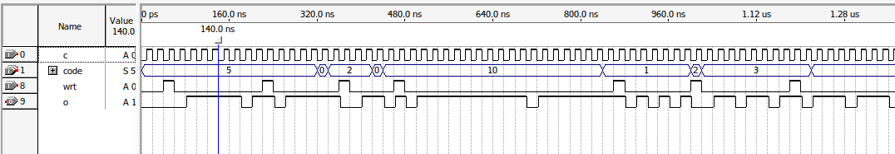
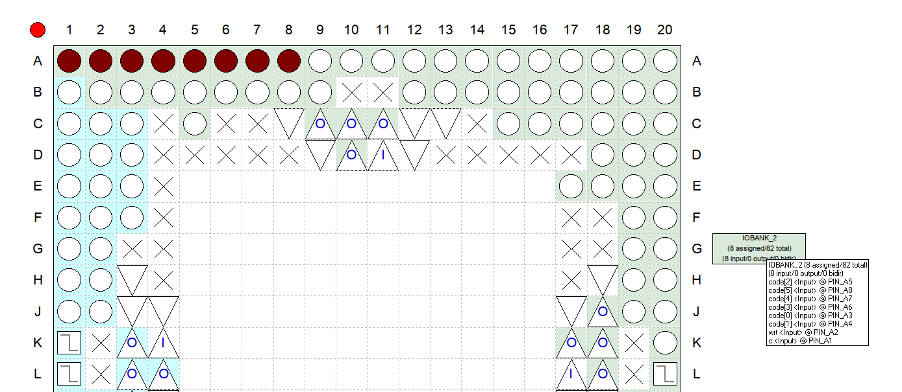

# Цель работы

Разработать проект формирователя импульсов, параметры которых задаются внешним  двоичным  параллельным  кодом,  в  среде  программирования  Quartus,  используя  языки описания аппаратуры. 

# Описание задания

Задание  заключается  в  формировании  импульсов,  параметры  которых  однозначно определяются  цифровым  управляющим  6-разрядным  двоичным  кодом.  Проект  устройства, который нужно реализовать на языке Verilog, должен иметь 1 выход и 8 входов: 

1) один вход для подачи тактовых импульсов,  
2) один вход для подачи импульса загрузки управляющего кода,  
3) 6 входов для подачи внешнего управляющего 6-разрядного двоичного кода.  

# Индивидуальное задание. Вариант 3

Индивидуальное задание:

$$
K_1 = N
$$
$$
K_0 = 1
$$

# Решение

Модуль fifth на вход принимает такты `c`, вход для импульса загрузки управляющего кода `wrt` и вход для управляющего кода `code`. На выход идёт лишь сигнал `o`.

В модуле был объявлен регистр N для хранения значения управляющего кода, регистр i для хранения номера итерации счётчика, а также регистр res для хранения вывода текущей итерации, он нужен чтобы избежать иголок и выровнять вывод по тактам.

Для выполнения задачи был задан слушатель позитивного фронта тактов `c`, в котором проверяется подача сигнала записи, в случае наличия которого, управляющий код записывается в регистр N, а регистры i и res обнуляются.

В случае отсутствия сигнала записи осуществляется сравнение значений регистров i и N, если i не дошёл до N, происходит его инкрементация, значение res при этом выставляется в 1, иначе i и res обнуляются до следующей итерации, на выходе в итоге получается логический 0 на один такт в соответствии с условием задачи.

## Verilog код

~~~{include=proj/fifth.v .verilog caption="Код программы"}
~~~

## Результат

## Вывод

Разработан проект формирователя импульсов, параметры которого задаются внешним  двоичным  параллельным  кодом,  в  среде  программирования  Quartus,  используя  языки описания аппаратуры. 