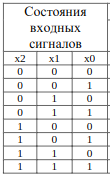
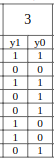
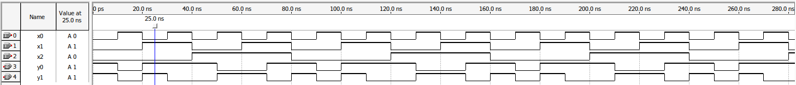

# Цель работы

Разработать  проект  комбинационного  устройства на  основе программируемой  логической  интегральной  схемы в среде программирования  Quartus с использованием  языков  описания  аппаратуры: приобрести  навыки  формирования проекта комбинационного устройства по заданной таблице истинности.

# Индивидуальное задание. Вариант 3

Индивидуальное задание:

 

# Решение

## Вывод выражений

Построим СДНФ для выходов

$$
y_0 = 
(\bar{x_0} \land \bar{x_1} \land \bar{x_2}) 
\lor
(\bar{x_0} \land x_1 \land \bar{x_2})
\lor
(x_0 \land x_1 \land \bar{x_2})
\lor
(\bar{x_0} \land \bar{x_1} \land x_2)
\lor
(x_0 \land x_1 \land x_2)

\\

y_1 = 
(\bar{x_0} \land \bar{x_1} \land \bar{x_2}) 
\lor
(\bar{x_0} \land x_1 \land \bar{x_2})
\lor
(\bar{x_0} \land x_1 \land x_2)
\lor
(x_0 \land \bar{x_1} \land x_2)
$$

## Упрощение

Упрощаем:

$$
y_0 =
\bar{x_0} \land (x1 \uparrow x2)
\lor
x_0 \land x_1
\\
y_1 = 
(\bar{x_0} \land (x_2 \rightarrow x_1))
\lor
(x_0 \land  \bar{x_1} \land x_2)
$$

## Verilog код

\verbatiminput{./proj/first.v}

## Результат

## Вывод

Разработан  проект  комбинационного  устройства на  основе программируемой  логической  интегральной  схемы в среде программирования  Quartus с использованием  языков  описания  аппаратуры: приобрести  навыки  формирования проекта комбинационного устройства по заданной таблице истинности.