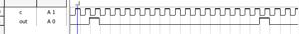
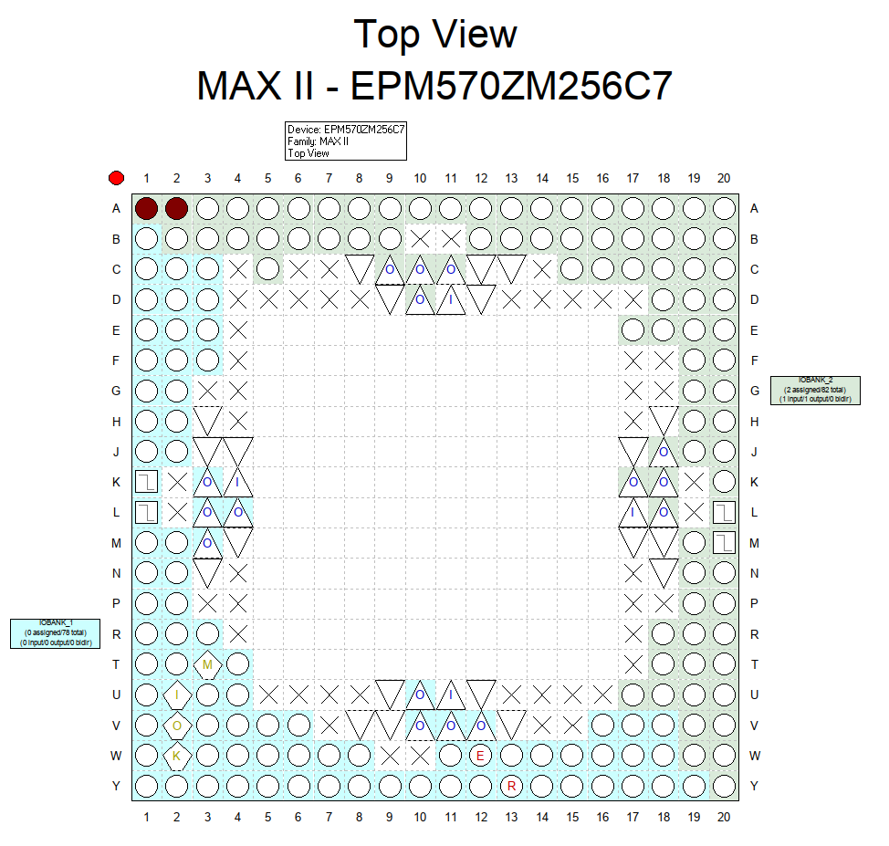

# Цель работы

Разработать проект формирователя импульсной последовательности с заданными свойствами в среде программирования Quartus, используя языки описания аппаратуры.

# Индивидуальное задание. Вариант 3

Индивидуальное задание:

$$
K_{nach} = 2 
$$
$$
K_1 = 1
$$
$$
K_0 = 16
$$

# Решение

## Таблица истинности

| n   | Dsi | Q0  | Q1  | Q2  | Q3  | Q4  | Q5  | Q6  | Q7  | Q8  | Q9  | Q10 | Q11 | Q12 | Q13 | Q14 | Q15 |
| --- | --- | --- | --- | --- | --- | --- | --- | --- | --- | --- | --- | --- | --- | --- | --- | --- | --- |
| 0   | 1   | 0   | 0   | 0   | 0   | 0   | 0   | 0   | 0   | 0   | 0   | 0   | 0   | 0   | 0   | 0   | 0   |
| 1   | 0   | 1   | 0   | 0   | 0   | 0   | 0   | 0   | 0   | 0   | 0   | 0   | 0   | 0   | 0   | 0   | 0   |
| 2   | 0   | 0   | 1   | 0   | 0   | 0   | 0   | 0   | 0   | 0   | 0   | 0   | 0   | 0   | 0   | 0   | 0   |
| 3   | 0   | 0   | 0   | 1   | 0   | 0   | 0   | 0   | 0   | 0   | 0   | 0   | 0   | 0   | 0   | 0   | 0   |
| 4   | 0   | 0   | 0   | 0   | 1   | 0   | 0   | 0   | 0   | 0   | 0   | 0   | 0   | 0   | 0   | 0   | 0   |
| 5   | 0   | 0   | 0   | 0   | 0   | 1   | 0   | 0   | 0   | 0   | 0   | 0   | 0   | 0   | 0   | 0   | 0   |
| 6   | 0   | 0   | 0   | 0   | 0   | 0   | 1   | 0   | 0   | 0   | 0   | 0   | 0   | 0   | 0   | 0   | 0   |
| 7   | 0   | 0   | 0   | 0   | 0   | 0   | 0   | 1   | 0   | 0   | 0   | 0   | 0   | 0   | 0   | 0   | 0   |
| 8   | 0   | 0   | 0   | 0   | 0   | 0   | 0   | 0   | 1   | 0   | 0   | 0   | 0   | 0   | 0   | 0   | 0   |
| 9   | 0   | 0   | 0   | 0   | 0   | 0   | 0   | 0   | 0   | 1   | 0   | 0   | 0   | 0   | 0   | 0   | 0   |
| 10  | 0   | 0   | 0   | 0   | 0   | 0   | 0   | 0   | 0   | 0   | 1   | 0   | 0   | 0   | 0   | 0   | 0   |
| 11  | 0   | 0   | 0   | 0   | 0   | 0   | 0   | 0   | 0   | 0   | 0   | 1   | 0   | 0   | 0   | 0   | 0   |
| 12  | 0   | 0   | 0   | 0   | 0   | 0   | 0   | 0   | 0   | 0   | 0   | 0   | 1   | 0   | 0   | 0   | 0   |
| 13  | 0   | 0   | 0   | 0   | 0   | 0   | 0   | 0   | 0   | 0   | 0   | 0   | 0   | 1   | 0   | 0   | 0   |
| 14  | 0   | 0   | 0   | 0   | 0   | 0   | 0   | 0   | 0   | 0   | 0   | 0   | 0   | 0   | 1   | 0   | 0   |
| 15  | 0   | 0   | 0   | 0   | 0   | 0   | 0   | 0   | 0   | 0   | 0   | 0   | 0   | 0   | 0   | 1   | 0   |
| 16  | 0   | 0   | 0   | 0   | 0   | 0   | 0   | 0   | 0   | 0   | 0   | 0   | 0   | 0   | 0   | 0   | 1   |
: Таблица истинности

$$
Dsi = \bar Q_0 \land \bar{Q_1} \land \bar{Q_2} \land \bar{Q_3} \land \bar{Q_4} \land \bar{Q_5} \land \bar{Q_6} \land \bar{Q_7} \land \bar{Q_8} \land \bar{Q_9} \land \bar{Q_{10}} \land \bar{Q_{11}} \land \bar{Q_{12}} \land \bar{Q_{13}} \land \bar{Q_{14}} \land \bar{Q_{15}}
$$

## Verilog код

Для реализации регистра сдвига в коде на каждом такте синхронизации мы вычисляем сигнал dsi, а затем записываем его со сдвигом в регистр q.

Для создания задержки в 2 такта, на выходной контакт сигнал мы подаём с первого бита регистра q;

~~~{include=proj/fourth.v .verilog caption="a"}
~~~

## Результат

## Вывод

Разработан проект формирователя импульсной последовательности с заданными свойствами в среде программирования Quartus, используя языки описания аппаратуры.