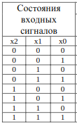
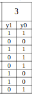
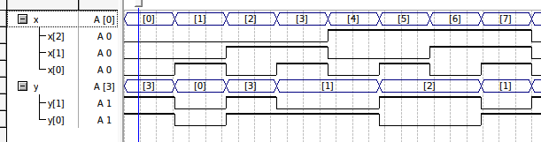
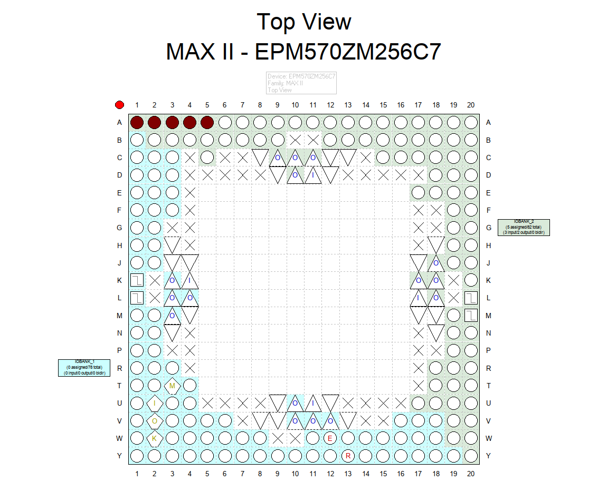

# Цель работы

Изучить принципы работы типовых функциональных узлов комбинационной логики: шифраторов, дешифраторов, мультиплексоров. Разработать проект преобразователя кодов на их основе, с использованием языков описания аппаратуры. Основной целью работы является формирование навыков использования модулей на языке описания аппаратуры.

# Индивидуальное задание. Вариант 3

Индивидуальное задание:

 

# Решение

## Мультиплексор

Для разработки мультиплексора была использована конструкция switch, которая в зависимости от входов на x[2..0] выдают разный сигнал на выходы y[1..0]

### Листинг кода

\verbatiminput{./proj/second.v}

### Временная диаграмма

### Схема подключения ПЛИС

## Шифратор Дешифратор

### Дешифратор:

Входной вектор x преобразуется в выходной вектор decoder, используя оператор case. Каждое значение входного вектора соответствует определенному значению выходного вектора.

### Шифратор:

Значения выходного вектора decoder используются для определения значений выходного вектора encoder, который является результатом логических операций над битами decoder.

### Дешифрация:

Вектор encoder обратно преобразуется в выходной вектор y с помощью оператора case, который сопоставляет значения вектора encoder с соответствующими значениями выходного вектора y в соответствии с заданной логикой дешифрации.

### Листинг кода

\verbatiminput{./proj/second1.v}

### Временная диаграмма

### Схема подключения ПЛИС

# Вывод

Изучены принципы работы типовых функциональных узлов комбинационной логики: шифраторов, дешифраторов, мультиплексоров. Разработан проект преобразователя кодов на их основе, с использованием языков описания аппаратуры. Получены навыки использования модулей на языке описания аппаратуры Verilog.
