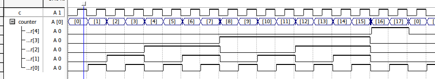
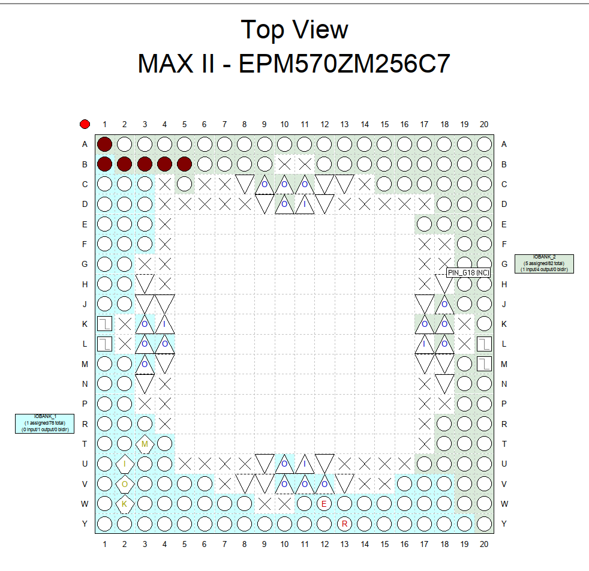

# Цель работы

Разработать  проект  счетчика  с  заданным  основанием  счета  в  среде программирования Quartus, с использованием языков описания аппаратуры.

# Индивидуальное задание. Вариант 3

Индивидуальное задание:

$$
M = 18
$$

# Решение

Для реализации счётчика мы используем конструкцию always, которая принимает событие на вход, в данном случае спад напряжения на "c", и исполняет необходимый код, в данном случае идёт проверка на равенство counter семнадцати, если проверка проходит, мы подаём на него ноль, в противном случае мы ставим его значение равным инкрементированному предыдущему.

\verbatiminput{./proj/third.v}

# Результат

## Вывод

Разработан  проект  счетчика  с  заданным  основанием  счета  в  среде программирования Quartus, с использованием языков описания аппаратуры.